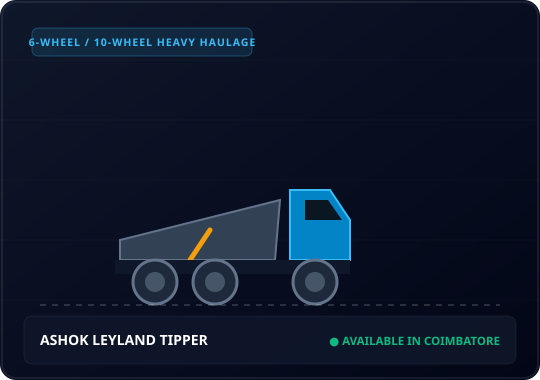

# THILLAI AMMAN CIVIL SUPPLIERS (TCS)
**Tagline:** Building Materials & Suppliers  
**Primary Region:** Coimbatore & Surrounding Areas (SITRA, Neelambur, Vilankurichi, Saravanampatti)  
**Live GitHub Pages URL:** [https://nakulanda031.github.io/thillai-amman-civil-suppliers-tcs/](https://nakulanda031.github.io/thillai-amman-civil-suppliers-tcs/)  
**Primary Phone Numbers:** [+91 73393 01146](tel:7339301146) / [+91 81243 61416](tel:8124361416)  
**WhatsApp:** [+91 73393 01146](https://wa.me/917339301146)  
**Address:** Text Park Road, Near SITRA, Near Vilankurichi, Coimbatore, Tamil Nadu — 641014  

---

## 1. Complete Project Structure

```
thillai-amman-civil-suppliers-tcs/
│
├── index.html                      # Complete, semantic, accessible single-page application
├── robots.txt                      # Search engine bot instructions
├── sitemap.xml                     # XML sitemap for Google / Bing indexing
├── README.md                       # Master business & technical operations manual
│
├── assets/
│   ├── css/
│   │   └── main.css                # Industrial design system (Glassmorphism, Strata motifs, responsive grid)
│   │
│   ├── js/
│   │   ├── main.js                 # Navigation, modals, instant search, filters, WhatsApp, lightbox
│   │   └── leads-store.js          # Client-side persistent lead engine + backend sync + CSV export
│   │
│   └── images/
│       ├── branding/
│       │   ├── tcs-logo.svg        # Official vector TCS emblem logo
│       │   └── favicon.svg         # 64x64 vector favicon
│       │
│       ├── materials/              # Complete product catalogue visuals
│       │   ├── m-sand.svg          # M-Sand (Manufactured Sand)
│       │   ├── p-sand.svg          # P-Sand (Plastering Sand)
│       │   ├── river-sand.svg      # River Sand
│       │   ├── blue-metal.svg      # Blue Metal (20mm / 40mm)
│       │   ├── jally.svg           # Jally / Graded Aggregates
│       │   ├── gravel.svg          # Gravel / Sub-Base Filler
│       │   ├── bricks.svg          # Red Clay Bricks
│       │   ├── blocks.svg          # Solid & Hollow Blocks
│       │   ├── size-stone.svg      # Size Stone / Rough Stone
│       │   ├── earth-filling.svg   # Earth Filling / Red Soil
│       │   └── debris-removal.svg  # Debris & Waste Removal
│       │
│       ├── equipment/              # Heavy equipment fleet visuals
│       │   ├── ashok-leyland-tipper.svg   # Ashok Leyland 1, 2 & 3 Unit Tipper Truck
│       │   ├── jcb-3dx-excavator.svg      # JCB 3DX Backhoe Excavator Loader
│       │   └── bull-skid-loader.svg       # Bull Skid Steer Loader
│       │
│       ├── projects/               # Real project showcases
│       │   ├── project-residential.svg    # SITRA residential site preparation
│       │   ├── project-commercial.svg     # Neelambur commercial complex aggregates
│       │   ├── project-road.svg           # Vilankurichi industrial access road
│       │   └── project-earthwork.svg      # Saravanampatti deep basement excavation
│       │
│       └── gallery/                # Lightbox gallery visuals
│           ├── gallery-1.svg to gallery-8.svg
│
└── backend/                        # Production Node.js / Express REST API
    ├── server.js                   # Express server entry point, rate limiting, MongoDB connect
    ├── package.json                # Dependencies (cors, dotenv, express, mongoose, multer, twilio, nodemailer)
    ├── .env.example                # Configuration template
    ├── README.md                   # Full backend setup and cloud deployment guide
    ├── models/
    │   └── Lead.js                 # Mongoose schema with statuses (NEW -> COMPLETED)
    ├── routes/
    │   └── leads.js                # Endpoints for Quote, Booking, Contact, CSV Export
    └── utils/
        ├── upload.js               # Multer drawing file upload handler (PDF, PNG, JPG, DWG)
        └── notify.js               # Automatic Office Email + Twilio WhatsApp notifications
```

---

## 2. Explanation of Major Features

1. **Brand Identity & Industrial Visual Design**:
   - Modern color palette: Sky Blue (`#38BDF8`), Dark Navy (`#0A1622`), Metallic Silver (`#E2E8F0`), Sand Earth (`#C89B6C`).
   - "Strata" signature motif representing layered natural earth materials.
   - Glassmorphic navigation bar that transitions smoothly on scroll.

2. **Lead Generation & Conversion Funnel**:
   - **Visitor** → Learns about TCS → Explores Materials/Machinery → Clicks "Request Price" / "Book Now" → System pre-fills modal → One-click submit saves lead + generates formatted WhatsApp chat → **TCS receives lead & contacts customer**.

3. **Building Materials Interactive Filter & Instant Search**:
   - Client-side category filters (`ALL`, `SAND`, `AGGREGATES`, `BRICKS & BLOCKS`, `EARTH MATERIALS`, `WASTE REMOVAL`).
   - Real-time search bar that filters cards instantly by name or description without page reloads.

4. **Dedicated Equipment Rental Booking Engine**:
   - Dedicated cards for Ashok Leyland Tipper, JCB 3DX, and Bull Skid.
   - Clicking "Book Now" opens the Booking Modal with that specific machine pre-selected as an active badge.

5. **Civil Construction Services (12 Services)**:
   - Excavation, Earth Filling, Land Levelling, Demolition Support, Construction Debris Removal, Building Waste Removal, Material Transportation, Site Preparation, Civil Construction Support, Residential Support, Commercial Support, Infrastructure Support.

6. **Interactive Click-to-Expand Image Gallery Lightbox**:
   - Filterable gallery by category (`MATERIALS`, `EQUIPMENT`, `CIVIL WORKS`, `DELIVERY`).
   - Lightbox modal with Next/Previous navigation, keyboard Arrow keys, and Escape to close.

7. **Local Service Area Breakdown & Google Maps Embed**:
   - Details coverage in SITRA, Neelambur, Vilankurichi, Saravanampatti, Kalapatti, Peelamedu, and Coimbatore city.

8. **Admin Customer Lead Dashboard**:
   - Discreet "Owner Lead Portal" button in footer protected by passcode (`tcs2026`).
   - View all customer enquiries, filter by status (`NEW`, `CONTACTED`, `QUOTED`, `CONFIRMED`, `COMPLETED`, `CANCELLED`).
   - Direct 1-click customer WhatsApp follow-up button.
   - Direct "Export CSV" button to download all customer enquiries for Excel/Google Sheets.

9. **Zero-Failure Offline & Online Architecture**:
   - Client-side persistence via `localStorage` ensures no leads are ever lost if the backend is offline or during static GitHub Pages hosting.
   - Automatically synchronizes with the Express backend whenever online.

---

## 3. List of All Working Buttons & Links

| Button / Link | Location | Action |
|---|---|---|
| **Logo Link** | Sticky Header | Smooth scrolls to top (`#home`) |
| **Nav Links (9)** | Header & Drawer | Smooth scroll to Home, About, Materials, Equipment, Services, Projects, Gallery, Areas, Contact |
| **"Call Now" / "73393 01146"** | Header, Hero, Mobile | Opens native mobile phone dialer (`tel:7339301146`) |
| **"81243 61416"** | Contact & Footer | Opens secondary phone dialer (`tel:8124361416`) |
| **"WhatsApp Us"** | Hero, Footer, Drawer | Opens WhatsApp with general enquiry greeting |
| **"Get a Quote"** | Header, Hero, Drawer | Opens Request Quote Modal |
| **"Request Price" (11 buttons)** | Materials cards | Opens Quote Modal pre-filled with selected material |
| **"WhatsApp" (11 buttons)** | Materials cards | Opens WhatsApp with pre-filled enquiry for that specific material |
| **"Book Now" (3 buttons)** | Equipment cards | Opens Equipment Booking Modal pre-filled with machine name |
| **"Call Now" (3 buttons)** | Equipment cards | Opens dialer (`tel:7339301146`) |
| **"WhatsApp" (3 buttons)** | Equipment cards | Opens WhatsApp with machine rental specifications |
| **"Enquire Now →" (12 buttons)** | Civil Services cards | Opens Quote Modal pre-filled with that specific civil service |
| **"Enquire for Similar Work" (4 buttons)** | Projects cards | Opens Quote Modal pre-filled with project scope |
| **Gallery Thumbs (8 items)** | Image Gallery | Opens full-screen interactive Lightbox modal |
| **Lightbox Prev / Next / Close** | Lightbox modal | Cycles images or closes lightbox |
| **"Send Message"** | Contact Section | Validates and submits general contact enquiry |
| **Floating WhatsApp Button** | Bottom-right screen | Opens WhatsApp chat from anywhere on the site |
| **Floating Call Button** | Mobile bottom bar | 1-tap phone call on mobile devices |
| **"Owner Lead Portal"** | Footer | Prompts for owner passcode and opens Admin Lead Table |
| **"Export CSV"** | Admin Modal | Downloads formatted CSV file of all enquiries |

---

## 4. List of All Forms

1. **Request Quote Form (`#form-quote`)**:
   - Fields: Name (required), Mobile (10-digit required), Email, Material/Service (dropdown), Quantity, Unit (Loads, Units, Tons, CFT, Nos), Delivery Location (required), Required Date, Project Type, Upload Drawing (optional), Message.
   - Buttons: "Submit Quote Request" (records lead and shows feedback) and "WhatsApp Instead" (transfers all entered fields directly to WhatsApp).

2. **Equipment Booking Form (`#form-booking`)**:
   - Fields: Equipment (auto-populated hidden & badge), Name (required), Mobile (required), Site Location (required), Required Date (required), Shift/Time, Estimated Duration, Nature of Work, Special Instructions.
   - Buttons: "Confirm Booking Request" and "WhatsApp Instead".

3. **Contact Message Form (`#form-contact`)**:
   - Fields: Name (required), Mobile (required), Email (optional), Message (required).
   - Buttons: "Send Message" and "Chat Directly on WhatsApp".

---

## 5. WhatsApp Functionality Explanation

Every WhatsApp button dynamically constructs a contextual message using standard URL encoding:
```
https://wa.me/917339301146?text=<ENCODED_MESSAGE>
```
Examples:
- **For M-Sand:**  
  `Hello TCS, I would like to enquire about M-Sand. Quantity: Delivery Location: Coimbatore Required Date:`
- **For JCB Excavator:**  
  `Hello TCS, I would like to enquire about JCB 3DX Excavator rental. Site Location: Coimbatore Required Date: Duration / Shift: Work Type:`
- **From Quote Modal:**  
  Transfers all fields typed into the form directly into the WhatsApp message text!

---

## 6. How to Replace Images with Your Real Photos

All images are neatly organized in `assets/images/`.

### To replace an image:
1. Copy your real photograph (e.g., photo taken of your Tipper truck).
2. Save it in the matching folder:
   - For Tipper: `assets/images/equipment/ashok-leyland-tipper.jpg`
   - For M-Sand: `assets/images/materials/m-sand.jpg`
3. Update the `src` attribute in `index.html`:
   ```html
   <!-- Before: -->
   

   <!-- After: -->
   
   ```

---

## 7. How to Add New Products, Equipment, or Projects

### Adding a New Building Material:
In `index.html`, inside `<div class="materials-grid" id="materialsGrid">`, copy any existing `.material-card` block:
```html
<div class="material-card" data-category="AGGREGATES">
  <div class="material-card-img-wrapper">
    
    <span class="material-badge">Grade / Size</span>
  </div>
  <div class="material-card-body">
    <h3>Product Name</h3>
    <p class="material-card-desc">Short description of material suitability.</p>
    <div class="material-card-actions">
      <button type="button" class="btn btn-primary btn-sm" data-open-modal="quote" data-material="Product Name">Request Price</button>
      <button type="button" class="btn btn-whatsapp btn-sm" data-wa-material="Product Name">WhatsApp</button>
    </div>
  </div>
</div>
```

---

## 8. How to Change Contact Details

To change phone numbers, address, or hours, update these key locations:
1. `index.html`: Search for `7339301146` and replace with your new number.
2. `assets/js/main.js`: Update `const WHATSAPP_PHONE = '917339301146';`
3. `backend/.env`: Update `OWNER_WHATSAPP_TO` and `NOTIFY_EMAIL`.

---

## 9. How to Deploy to GitHub Pages

1. Commit your changes:
   ```bash
   git add .
   git commit -m "Completely upgrade TCS business website"
   git push origin main
   ```
2. On GitHub:
   - Go to your repository **Settings** → **Pages**.
   - Under **Build and deployment** → Source: Select **Deploy from a branch**.
   - Branch: select `main` and `/ (root)`.
   - Click **Save**.
3. Your updated website will be live in ~60 seconds at:  
   `https://nakulanda031.github.io/thillai-amman-civil-suppliers-tcs/`

---

## 10. Performance, SEO & Security Summary

- **Performance**: Zero external render-blocking scripts; Google Fonts preconnected; CSS custom properties; pure vanilla JS; SVGs for crisp 4K rendering; lazy-loaded images.
- **SEO**: Valid H1/H2/H3 semantic hierarchy; Meta description tailored to Coimbatore civil supply; Open Graph & Twitter cards; Canonical URL; Schema.org `LocalBusiness` JSON-LD; robots.txt & sitemap.xml.
- **Security**: No sensitive keys exposed in frontend code; input sanitization; rate-limiting configured in backend; protected Admin Lead view.
